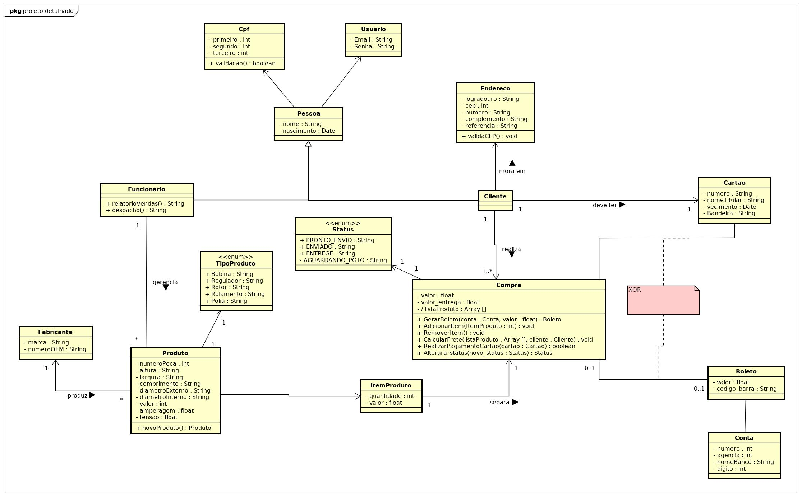
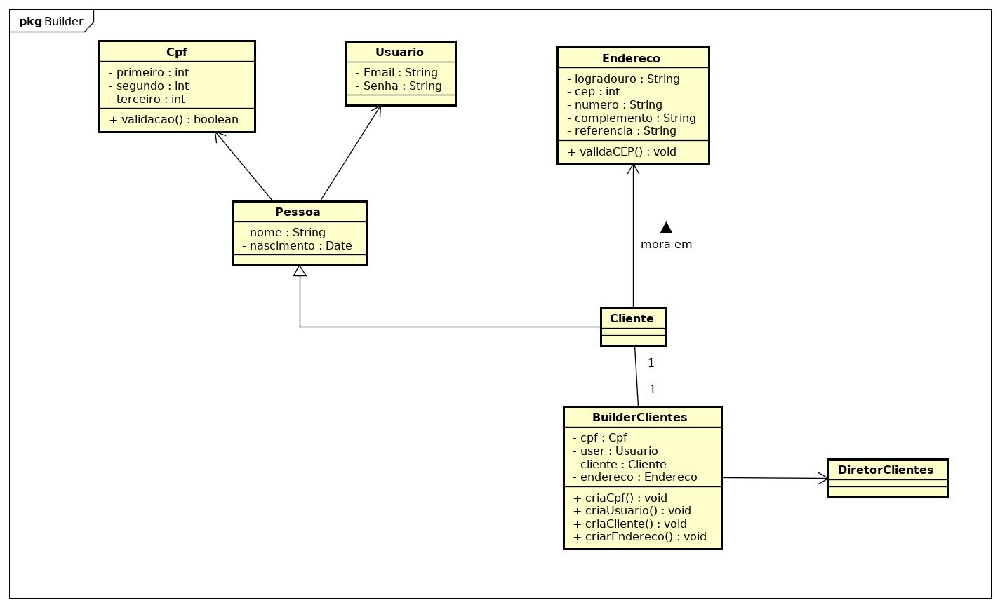
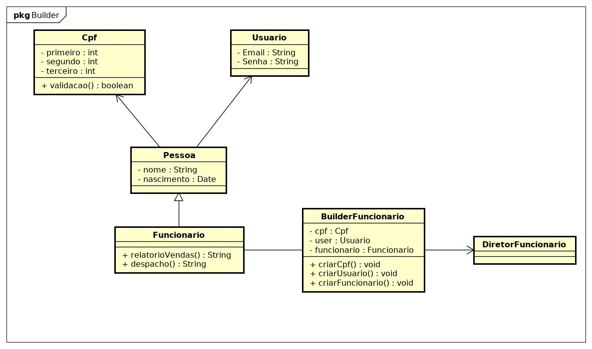
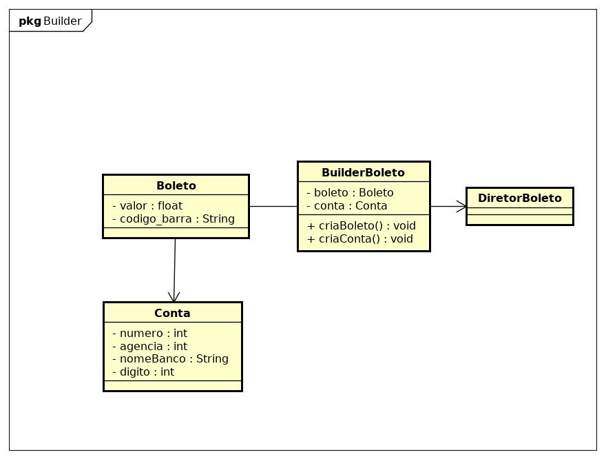
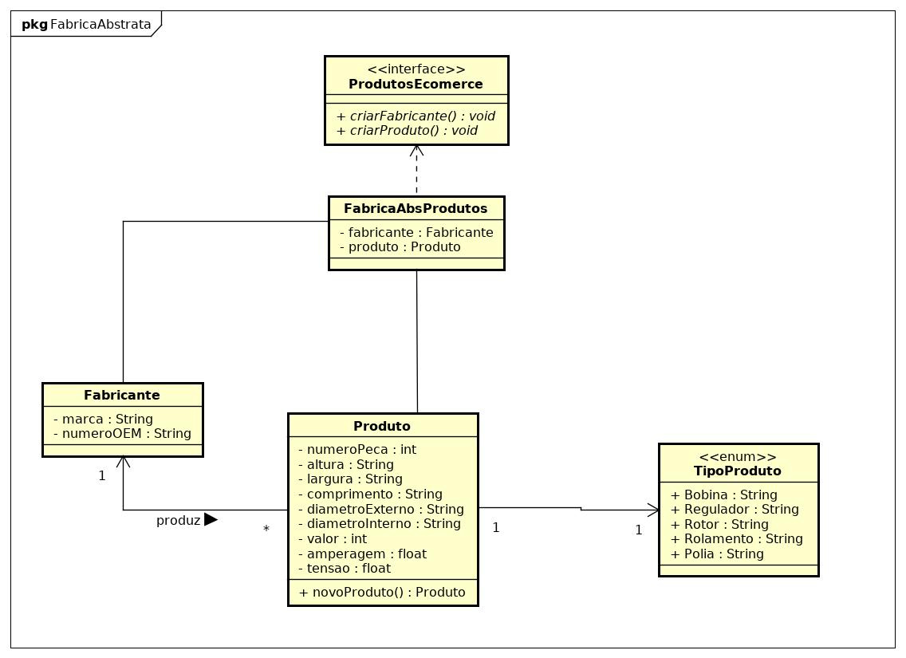
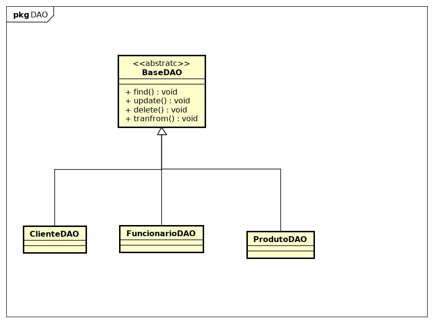

# Trabalho da Matéria de POO2 

A disciplina de Programação orientada ao objeto 2, apresentou o uso de padrôes de projeto, Design Parttens, para problemas comuns de programação.
O Uso de padrões de projeto, em sistemas grandes e complexos auxilia na manutenabilidade e desenvolvimento de código.
Com base no diagrama UML a seguir será mostrado alguns padrôes escolhidos para cada situação.

## Padrão Builder 
Esse padrão é composto por um Diretor e um Builder onde suas funções são:
1. Builder contém a receita de encapsulamento para fazer o objeto. 
2. Dreitor cria os objetos na respectiva ordem.
Dentro do escopo esse padrão fui usado para criar clientes e funcionários.

## Padrão Fábrica Abstrata
Implementa uma interface para criação de mais de um Objeto.
Dentro do escopo esse padrão fui usado para criar fabricantes e produtos.

## DAO
Usado para persistor dados dentro do banco de dados

