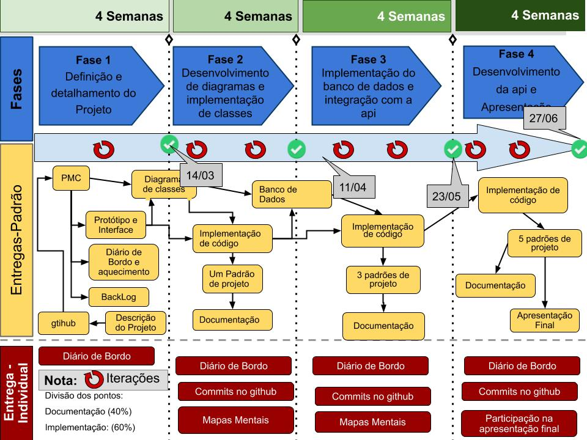

# Trabalho da  disciplina de Poo2 

## e-commerce de auto-peças

# Documento de requisitos
[documento de requisitos](DOCUMENTO_REQUISITOS.MD)

# Entrega 1
[primeira entrega de poo2](/entrega1/readme.md)
# Entrega 2
[segunda entrega de poo2](/entrega2/readme.md)
# Entrega 3

# Entrega 4

# Cronograma 

# Diário de Bordo
[Diário de bordo](DIARIO.MD)